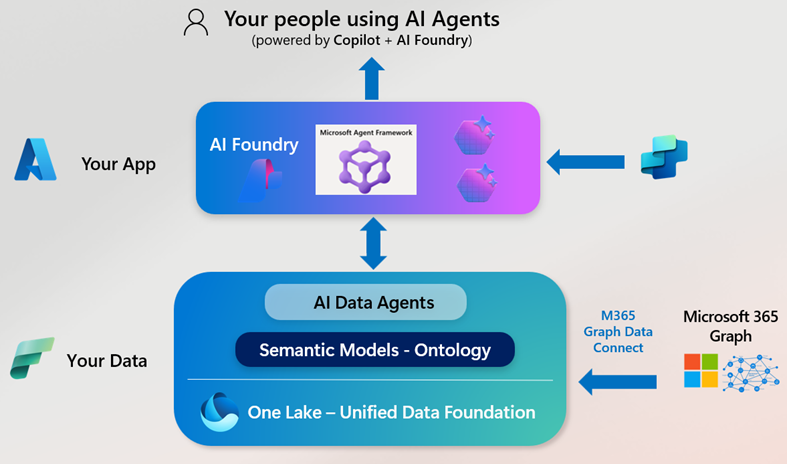
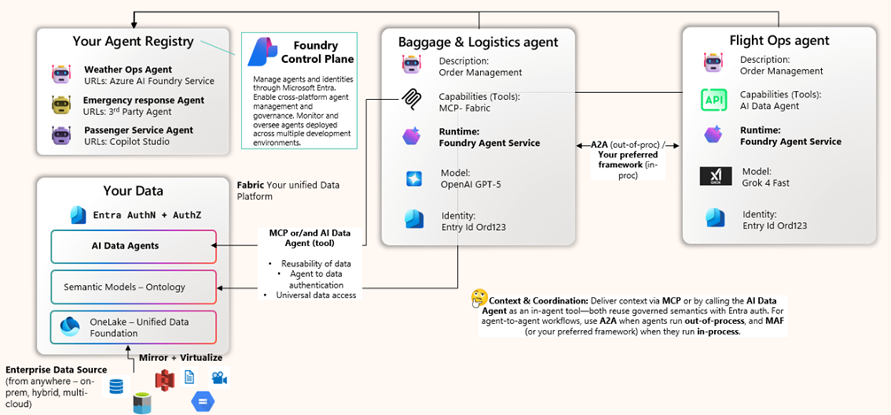

<!-- markdownlint-disable MD033 -->

## **🤖🧠 Enterprise AgenticRAG: Bringing Enterpirse Data to AI Agents** (WIP)

[](https://learn.microsoft.com/en-us/azure/ai-services/agents/overview)  [](https://learn.microsoft.com/en-us/azure/ai-services/agents/how-to/tools/fabric?tabs=csharp&pivots=overview) [](LICENSE)

**Enterprise AgenticRAG** demonstrates how to move from basic chatbots to AI that drives critical decisions—powered by rich, real-time, enterprise-grade context. This system connects specialized AI agents to your governed data layer, transforming static retrieval into intelligent, multi-step decisioning.

## **🏗️ The Enterprise Platform for the AI Era**

<div align="center">



</div>

### **Azure — Your Global Application Foundation**
Build and run mission-critical applications on Azure—the secure, global base for compute, identity, storage, networking, and event-driven services. Azure provides the operational discipline (reliability, HA/DR, zero-trust identity) and primitives teams need to ship at enterprise scale.

### **Microsoft Fabric — Your Unified Data Platform**
Fabric delivers a single, SaaS-based data foundation built on Azure—bringing together Data Factory, Synapse Data Engineering, Real-Time Analytics, Power BI, and Data Science in OneLake. It unifies structured and unstructured data into governed semantic models and ontologies, enables AI Data Agents that natively connect to those semantics, and seamlessly integrates Microsoft 365 data into one authoritative data layer ready for AI.

### **Azure AI Foundry — Your Unified AI Development Platform**
Foundry is where AI prototypes become products—enterprise-ready from day one. It standardizes agent and AI application development with secure, multi-service orchestration; first-class access to state-of-the-art LLM providers; built-in evaluation, monitoring, and lineage; and a managed single-agent architecture using Azure AI Foundry Agent Service.

## **🔄 From Static Documents to Enterprise Intelligence**

**Standardize. Govern. Scale.**

Intelligence comes from specialization. In Azure AI Foundry, you decompose problems into single-purpose agents that the platform manages for you. This removes custom plumbing overhead and lets you scale from one agent to millions of invocations without rewriting foundations.

Those agents get the right context by combining:
- **Azure AI Search** — high-quality retrieval over documents and metadata
- **Cosmos DB** — operational stores for real-time data
- **Microsoft Fabric** — living representations of your data: OneLake, governed semantic models/ontologies, and AI Data Agents that sit natively on those semantics

With this stack, agents connect directly to your unified, governed data layer. The runtime sits securely on Azure with enterprise identity and security. Your agents perform multi-step analytical decisioning against real enterprise context.

## **⚡ When Everything Comes Together**

Azure provides the secure, global foundation. Fabric supplies governed, living context in OneLake. Foundry turns it into action with specialized agents.

In our reference app, a **Fabric-powered Ops Context Agent** retrieves trusted facts (flights, baggage, routes, SLAs) while a **Foundry Decision Ops Agent** runs Python tools for KPIs, forecasts, what-ifs, and recovery plans—routed by a lightweight orchestrator. The result: a single chat workspace that answers "what's happening," explains "why," and recommends "what to do next," with citations back to your data.

For executives, this means critical decisions made in minutes, not meetings: quantify impact, compare options, and push actions to teams—confidently—because every step is grounded in governed enterprise data, enterprise identity, and enterprise controls.

<div align="center">



</div>

## **🚀 Embracing Agentic RAG as a Pattern**

> "Agentic Retrieval-Augmented Generation (Agentic RAG) transcends these limitations by embedding autonomous AI agents into the RAG pipeline. These agents leverage agentic design patterns—reflection, planning, tool use, and multi-agent collaboration—to dynamically manage retrieval strategies, iteratively refine contextual understanding, and adapt workflows through clearly defined operational structures."  
> — *Singh et al., [Agentic Retrieval-Augmented Generation: A Survey on Agentic RAG](https://arxiv.org/abs/2501.09136v3)*

Agentic RAG empowers organizations to move beyond rigid, one-shot retrieval—automating continuous **search**, **validation**, and **action** across information sources in real time. The AI locates, validates, and polishes the critical retrieval step, providing LLMs with the precise information needed at exactly the right moment.

> [!NOTE]  
> Fresh from Build 2025: If you're interested in this space, I highly recommend exploring [Azure AI Search's approach](https://techcommunity.microsoft.com/blog/azure-ai-services-blog/introducing-agentic-retrieval-in-azure-ai-search/4414677) and the latest developments in agentic retrieval.

[](https://www.youtube.com/watch?v=eJ_eS-V_Bvk)

<div align="center">

**▶️ [Watch the demo video on YouTube](https://www.youtube.com/watch?v=eJ_eS-V_Bvk)**

</div>

## **🤖 Building Agentic Systems in Azure**

Our approach in ths repo is to keep it simple and to the point, starting with the development of robust, scalable **enterprise single agents** using the Azure AI Foundry Agent Service. These production-ready agents come equipped with integrated tools, persistent memory, traceability, and isolated execution—providing a solid foundation before scaling up.

Then, of course, we'll tackle communication patterns between single agents. Just as clear conversation drives human collaboration, real-time event exchange between agents unlocks their full potential as a cohesive system. By leveraging frameworks like **Semantic Kernel**—or even crafting your own— you can establish an event-driven architecture that seamlessly ties everything together (single-agents) to build multi-agent systems. Here is my high level formula to build MaS

```text
Multi-Agent Architecture = Σ (Production-Ready Single Agents [tools, memory, traceability, isolation]) + Preferred Framework (e.g., Semantic Kernel, AutoGen)
```

**Breaking It Down**

- **Step 1:** Build robust, scalable single agents with the **Azure AI Foundry Agent Service**, managing them as micro-services.
- **Step 2:** For complex tasks, deploy a fleet of specialized agents that communicate seamlessly via an event-driven framework of your choice.

## **👩🏾‍💻 How to Get Started**

This reference application demonstrates the enterprise platform stack in action—connecting Azure, Fabric, and Foundry to deliver real-time operational intelligence.

**Architecture**: Hierarchical multi-agent system using the `.as_tool()` pattern

<div align="center">

```
┌─────────────────────────────────────────────┐
│   AirlineIntelligentAssistant (Main)        │
│   - Entry point for all user queries        │
│   - Coordinates between sub-agents          │
└──────────────┬──────────────────────────────┘
               │
       ┌───────┴───────┐
       │               │
       ▼               ▼
┌──────────────┐  ┌──────────────────────┐
│AirlineOps    │  │RealtimeAssistant     │
│Context       │  │(Azure Foundry)       │
│              │  │                      │
│- Fabric Data │  │- Bing Search         │
│- Flights     │  │- File Search         │
│- Baggage     │  │- Weather             │
│- Routes      │  │- Time                │
│- SLA Metrics │  │                      │
└──────────────┘  └──────────────────────┘
```

</div>

**Key Components**:
- **Main Orchestrator** (Azure OpenAI): Routes queries to specialized sub-agents
- **Fabric Data Agent**: Retrieves operational data from Microsoft Fabric (flights, baggage, routes, SLAs)
- **Realtime Assistant** (Azure AI Foundry): Provides web search, file search, weather, and time capabilities

**Run the App**:

1. **Activate Environment**:
   ```bash
   conda activate <your_environment_name>
   ```

2. **Install Dependencies**:
   ```bash
   pip install -r requirements.txt
   ```

3. **Run the Application**:
   ```bash
   make run_app
   # or directly:
   streamlit run app/main.py
   ```

**Query Examples**:
- "What flights are delayed at ORD right now?"
- "Show me baggage mishandling rate for JFK this week"
- "What's the weather in New York and are there any delays?"

This demonstrates how Azure provides the foundation, Fabric supplies governed data, and Foundry enables intelligent agent orchestration—all working together to deliver enterprise-grade AI decisioning.

> [!NOTE]  
> This is a work-in-progress reference implementation. Full documentation and deployment guides coming soon.

## 📚 More Resources

- **[Azure AI Foundry](https://azure.microsoft.com/en-us/products/ai-foundry/?msockid=0b24a995eaca6e7d3c1dbc1beb7e6fa8#Use-cases-and-Capabilities)**: Develop and deploy custom AI apps and APIs responsibly with a comprehensive platform.
- **[Azure AI Foundry Agent Service](https://learn.microsoft.com/en-us/azure/ai-services/agents/overview)**: Learn about Azure AI Foundry Agent Service and its capabilities.
- **[Semantic Kernel Documentation](https://learn.microsoft.com/en-us/semantic-kernel/overview/)**: Detailed documentation on Semantic Kernel's features and capabilities.
- **[Fabric Data Agent](https://learn.microsoft.com/en-us/azure/ai-services/agents/how-to/tools/fabric?tabs=csharp&pivots=overview)** – How-to guide on connecting Microsoft Fabric to your Agentic RAG pipeline.  
- **[SharePoint Data Agent](https://learn.microsoft.com/en-us/azure/ai-services/agents/how-to/tools/sharepoint?tabs=csharp&pivots=overview)** – Steps to configure OBO and surface SharePoint content via agents.  
- **[Grounding with Bing Search](https://learn.microsoft.com/en-us/azure/ai-services/agents/how-to/tools/bing-grounding?tabs=python&pivots=overview)** – Documentation for integrating live web search into your workflows.  
- **[Azure AI Search tool](https://learn.microsoft.com/en-us/azure/search/semantic-vector-search-overview)** – Semantic and vector search capabilities to enrich retrieval.  

<br>

> [!IMPORTANT]  
> This software is provided for demonstration purposes only. It is not intended to be relied upon for any production workload. The creators of this software make no representations or warranties of any kind, express or implied, about the completeness, accuracy, reliability, suitability, or availability of the software or related content. Any reliance placed on such information is strictly at your own risk.
