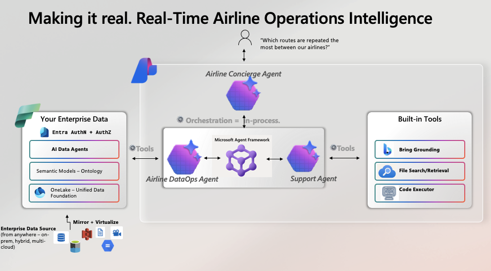

<!-- markdownlint-disable MD033 -->

# 🤖 AgenticRAG with Azure AI Foundry + Fabric

[](https://learn.microsoft.com/en-us/azure/ai-services/agents/overview) [](https://learn.microsoft.com/en-us/azure/ai-services/agents/how-to/tools/fabric) [](LICENSE)

Wire up AI agents with enterprise data. This demo connects Azure AI Foundry agents to Microsoft Fabric data sources—so your agents can query real data, search the web, and combine multiple sources to answer questions.

<div align="center">

[](https://vimeo.com/1146442378)


</div>

## What You'll Learn

- How to use **Azure AI Foundry Agent Service** (managed agents with Bing, file search, custom tools)
- How to connect agents to **Microsoft Fabric** data via the Fabric Data Agent
- How to build **multi-agent systems** using the "agent as tool" pattern

## The Architecture

```
┌─────────────────────────────────────────────┐
│   AirlineIntelligentAssistant (Orchestrator)│
│   Routes queries to the right sub-agent     │
└──────────────┬──────────────────────────────┘
               │
       ┌───────┴───────┐
       ▼               ▼
┌──────────────┐  ┌──────────────────────┐
│AirlineOps    │  │RealtimeAssistant     │
│Context       │  │                      │
│              │  │- Bing Search         │
│- Fabric Data │  │- File Search         │
│  Agent       │  │- Weather             │
│- Flights     │  │- Time                │
│- Baggage     │  │                      │
└──────────────┘  └──────────────────────┘
     ↓                    ↓
  Fabric IQ          Azure AI Foundry
  (OneLake)          (Agent Service)
```

<div align="center">


</div>

## Fabric IQ & Data Agents

The `AirlineOpsContext` agent uses **[Fabric IQ](https://learn.microsoft.com/en-us/fabric/data-science/concept-what-is-iq)** to query data. Fabric IQ unifies your OneLake data (lakehouses, warehouses, semantic models) with business semantics via ontologies.

The **[Fabric Data Agent](https://learn.microsoft.com/en-us/fabric/data-science/concept-data-agent)** is the piece that lets you ask questions in plain English—it translates to SQL/DAX/KQL automatically.

**How it fits together:**

```
"What flights are delayed at ORD?"
        ↓
  Orchestrator → AirlineOpsContext tool
        ↓
  Fabric Data Agent (NL → SQL)
        ↓
  Query runs against warehouse
        ↓
  Results formatted and returned
```



## Quick Start

```bash
git clone https://github.com/pablosalvador10/gbb-foundry-fabric-agenticrag.git
cd gbb-foundry-fabric-agenticrag

make install
conda activate gbb-foundry-agenticrag

cp .env.example .env   # Add your Azure creds
make run
```

**Prerequisites:** Python 3.11+, Conda, Azure subscription (OpenAI + AI Foundry, optionally Fabric)

## Try These Queries

```
"What flights are delayed at ORD?"
"Show me baggage stats for JFK this week"
"What's the weather in New York?"
```

## Project Structure

```
app/
├── main.py              # Streamlit entry point
├── settings.py          # Config
└── agent_registry/      # Agent definitions
    ├── AirlineIntelligentAssistant/   # Orchestrator
    ├── AirlineOpsContext/             # Fabric data agent
    └── RealtimeAssistant/             # Foundry agent
src/                     # Reusable modules
utils/                   # Logging, helpers
labs/                    # Notebooks & tutorials
```

## Resources

- [Azure AI Foundry Agent Service](https://learn.microsoft.com/en-us/azure/ai-services/agents/overview)
- [Fabric Data Agent](https://learn.microsoft.com/en-us/azure/ai-services/agents/how-to/tools/fabric)
- [Fabric IQ](https://learn.microsoft.com/en-us/fabric/data-science/concept-what-is-iq)
- [Bing Grounding](https://learn.microsoft.com/en-us/azure/ai-services/agents/how-to/tools/bing-grounding)

---

> ⚠️ Demo/learning repo. Understand the patterns here, then build your own.
